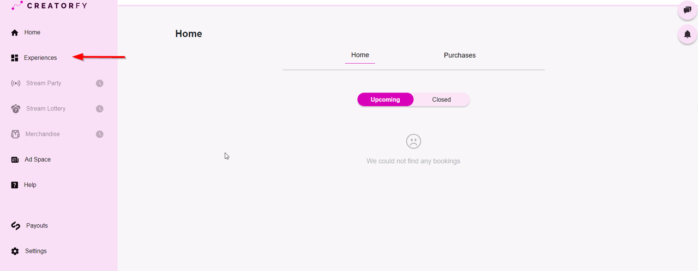
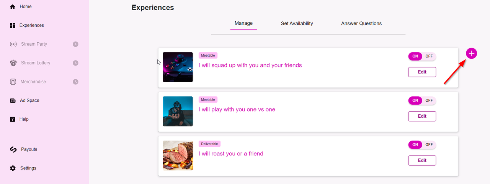
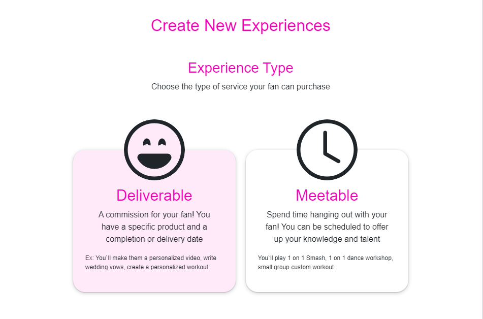
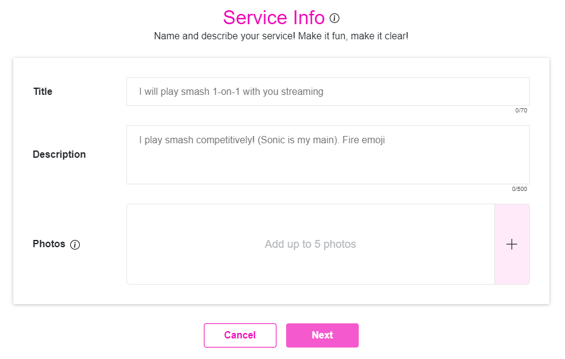
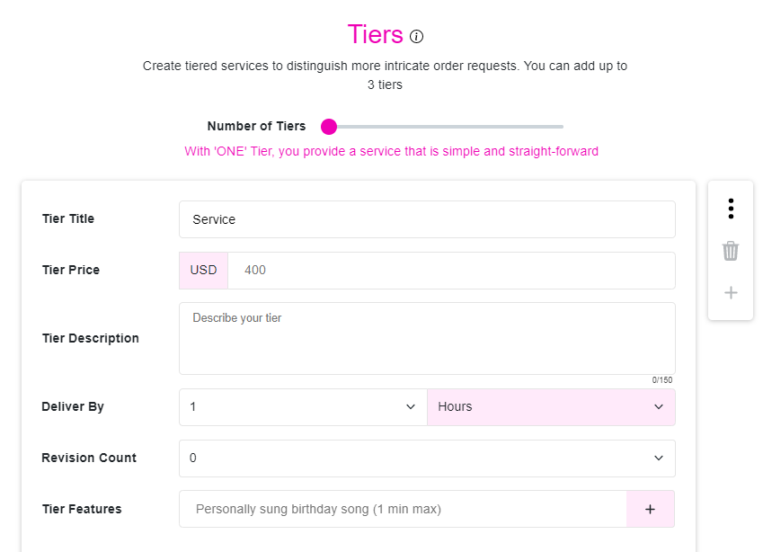
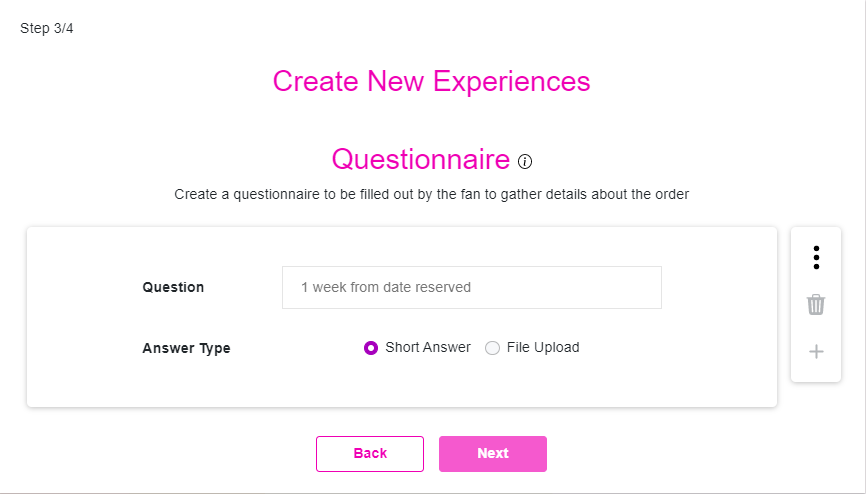
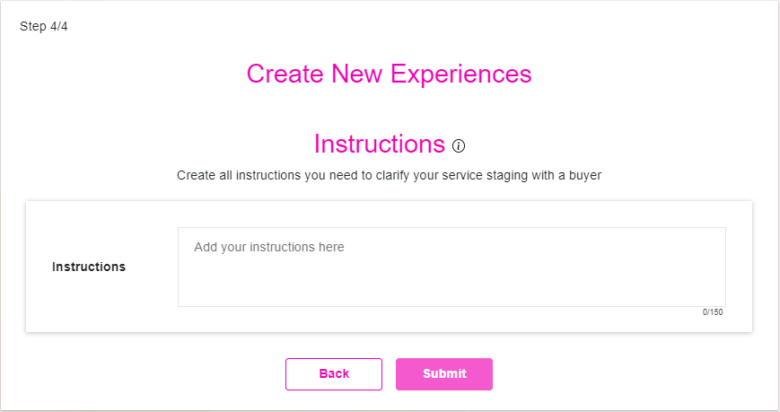

# List a Paid Experience

### **To create a new Paid Experience on Creatorfy, follow these steps:**
1. Login to your Creatorfy account and navigate to the "Experiences" tab on the main navigation menu.   

2. Click on the "Add" button to add a new Experience. You can also Edit, Delete, or Turn Off the ones we pre-populated as recommendations for you.  

3. Choose between "Meetable Service" and "Deliverable Service". Provide a catchy and descriptive title for your Experience that will attract Fans.

    - Deliverables are a product or service that can be delivered to your Fans without you needing to interact with them live. This could include anything from a digital product to a physical item.   

    - Meetables are Experiences that require your live presence. This could be anything from one-on-one coaching sessions to a 10 minutes live hangout session on stream.  

4. Create a title and a brief overview of the benefits or outcomes that Fans can expect from buying your service. Help them understand the value that your service provides and why they should choose it over other options.  

5. Tiered services are optional but it provides more options for Fans, and gives them a bit of shopping power. Offering up to 3 tiers allows you to appropriately price your efforts and helps Fans who are on a budget.  

6. Create a questionnaire of prerequisites to be filled out by the fan to help you gather details about the order. Things like discord username, in-game username, etc.  

7. Create all instructions you need the Fan to follow in order for the Experience to go smoothly.  
  
